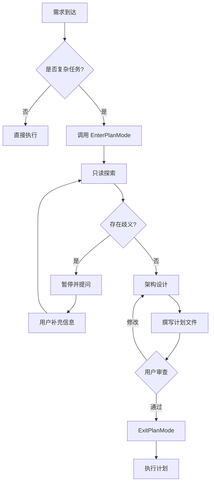

# Claude Code 技能包集合

<div align="center">


**生产级别的 Claude Code 技能包，助力高效开发**

[快速开始](#快速开始) • [技能列表](#技能列表) • [使用指南](#使用指南) • [技术栈对比](#技术栈对比)

</div>

---

## 目录

- [简介](#简介)
- [技能列表](#技能列表)
  - [1. Claude Plan Mode](#1-claude-plan-mode)
  - [2. React Dev](#2-react-dev)
  - [3. Vue Dev](#3-vue-dev)
- [快速开始](#快速开始)
- [技术栈对比](#技术栈对比)
- [使用指南](#使用指南)
- [目录结构](#目录结构)
- [最佳实践](#最佳实践)
- [贡献指南](#贡献指南)

---

## 简介

这是一个专为 **Claude Code** 设计的技能包集合，包含三个核心技能模块，涵盖架构规划、React 开发和 Vue 开发。每个技能包都经过精心设计，遵循生产级别的最佳实践，旨在提升开发效率和代码质量。

### 核心特性

- **生产级别规范**：所有技能包都遵循现代前端开发的最佳实践
- **类型安全优先**：强制使用 TypeScript strict 模式
- **组件化设计**：17 条组件封装原则，确保代码可维护性
- **性能优化**：内置性能优化策略和最佳实践
- **完整工作流**：从需求分析到代码实现的完整开发流程

---

## 技能列表

### 1. Claude Plan Mode

> **深度架构规划 + 强制代码落地**

完整复刻 Claude Code 官方 Plan Mode 架构，专为复杂项目的架构设计和技术规划而生。

#### 核心特性

- **零副作用原则**：只读模式运行，不修改现有代码
- **代码优先规则**：拒绝模糊描述，强制输出具体代码实现
- **询问优先于假设**：遇到歧义立即暂停，向用户提问
- **强制计划模板**：标准化的 Markdown 计划文件格式
- **动态交互机制**：支持迭代式规划和用户反馈

#### 适用场景

- 复杂系统的架构设计
- 大型重构项目的规划
- 技术选型和方案对比
- 需要详细实施步骤的任务

#### 参考文档

包含 8 个官方参考文件：
- `agent-prompt-plan-mode-enhanced.md`
- `system-reminder-plan-mode-is-active.md`
- `tool-description-enterplanmode.md`
- `tool-description-exitplanmode.md`
- 等...

#### 工作流程



---

### 2. React Dev

> **React/Next.js 开发专家代理**

资深 React 开发专家，提供生产级别的 Next.js 架构方案和代码实现。

#### 技术栈

| 类别 | 技术 | 说明 |
|------|------|------|
| **框架** | Next.js | App Router + Server Components |
| **语言** | TypeScript | Strict 模式 |
| **UI 库** | Shadcn-UI | 按需引入的组件库 |
| **样式** | Tailwind CSS | 原子化 CSS |
| **动画** | Framer Motion | 流畅的交互动画 |
| **状态管理** | Jotai | 原子化全局状态 |
| **数据请求** | SWR | 客户端数据获取与缓存 |
| **包管理器** | pnpm | 高效的依赖管理 |

#### 核心原则

1. **状态管理**：状态最小化、就近原则、单向数据流
2. **副作用管理**：严格使用 `useEffect`，优先使用 SWR
3. **性能优化**：避免重复渲染、懒加载、长列表虚拟化
4. **错误处理**：Error Boundary + try...catch
5. **RSC 策略**：默认 Server Component，最小化 Client Component

#### 组件规范

- 使用 ES6 箭头函数 + `React.FC`
- 必须添加 `displayName`
- 文件命名：`kebab-case.tsx`
- 路径别名：`@/` 指向 `src` 目录
- 单文件不超过 300 行，超过 500 行必须重构

#### 17 条组件封装原则

1. 基本属性绑定原则
2. 注释使用原则
3. export 暴露原则
4. 入参类型约束原则
5. class 与 style 规则
6. 继承透传原则
7. 事件配套原则
8. ref 绑定原则
9. 自定义扩展性原则
10. 受控与非受控模式原则
11. 最小依赖原则
12. 功能拆分与单一职责
13. 通用组件与业务组件边界
14. 最大深度扩展性
15. 多语言可配置化
16. 异常捕获与提示
17. 语义化原则

---

### 3. Vue Dev

> **Vue 3 开发专家代理**

资深 Vue 3 开发专家，基于 Composition API 提供生产级别的架构方案。

#### 技术栈

| 类别 | 技术 | 说明 |
|------|------|------|
| **框架** | Vue 3 | Composition API + `<script setup>` |
| **构建工具** | Vite | 快速构建与热更新 |
| **语言** | TypeScript | Strict 模式 |
| **UI 库** | Element Plus / Naive UI | 按需引入 |
| **样式** | Tailwind CSS / Scoped SCSS | 灵活的样式方案 |
| **状态管理** | Pinia | 原子化状态管理 |
| **路由** | Vue Router 4 | 官方路由方案 |
| **动画** | VueUse Motion / GSAP | 动画解决方案 |
| **包管理器** | pnpm | 高效的依赖管理 |

#### 核心原则

1. **状态管理**：状态局部化，共享状态使用 Pinia
2. **副作用管理**：谨慎使用 `watch` 和 `watchEffect`
3. **性能优化**：`shallowRef`/`shallowReactive`、虚拟化、`<KeepAlive>`
4. **错误处理**：`errorCaptured` + try...catch
5. **组件策略**：轻量化组件，逻辑抽离到 composables

#### 组件规范

- 使用 `<script setup lang="ts">`
- 文件命名：`kebab-case.vue`
- 单文件不超过 300 行
- 所有 props 必须 JSDoc 注释
- 使用 `v-bind="$attrs"` 透传属性
- 通过 `defineExpose` 暴露方法

#### Vue 特有的 17 条组件封装原则

在 React 版本基础上，特别强调：
- `props`、`emit`、`slots` 的正确使用
- `v-model` 受控模式支持
- `defineExpose` 正确暴露
- 递归组件支持
- i18n 国际化集成

---

## 快速开始

### 前置要求

- 安装 [Claude Code CLI](https://claude.com/claude-code)
- Node.js >= 18
- pnpm >= 8

### 安装技能包

1. 克隆或下载本仓库到本地：

```bash
git clone <repository-url>
cd skills
```

2. 将技能包目录链接到 Claude Code 技能目录：

```bash
# macOS/Linux
ln -s $(pwd)/claude-plan-mode ~/.claude/skills/claude-plan-mode
ln -s $(pwd)/react-dev ~/.claude/skills/react-dev
ln -s $(pwd)/vue-dev ~/.claude/skills/vue-dev

# Windows (需要管理员权限)
mklink /D "%USERPROFILE%\.claude\skills\claude-plan-mode" "%CD%\claude-plan-mode"
mklink /D "%USERPROFILE%\.claude\skills\react-dev" "%CD%\react-dev"
mklink /D "%USERPROFILE%\.claude\skills\vue-dev" "%CD%\vue-dev"
```

3. 验证安装：

```bash
claude skills list
```

---

## 技术栈对比

### 前端框架对比

| 特性 | React Dev | Vue Dev |
|------|-----------|---------|
| **核心框架** | Next.js (App Router) | Vue 3 (Composition API) |
| **构建工具** | Next.js 内置 | Vite |
| **组件语法** | JSX/TSX | SFC (Single File Component) |
| **状态管理** | Jotai (原子化) | Pinia (原子化) |
| **数据请求** | SWR | vue-query / swrv |
| **路由方案** | Next.js 文件路由 | Vue Router 4 |
| **样式方案** | Tailwind CSS | Tailwind CSS / Scoped SCSS |
| **动画库** | Framer Motion | VueUse Motion / GSAP |
| **UI 组件库** | Shadcn-UI | Element Plus / Naive UI |
| **服务端渲染** | RSC + SSR | SSR (Nuxt 3) |

### 适用场景对比

| 场景 | 推荐技能 | 理由 |
|------|----------|------|
| **企业级后台管理系统** | Vue Dev | Element Plus 生态成熟，表单处理强大 |
| **营销落地页/官网** | React Dev | Next.js SEO 优化出色，RSC 性能优异 |
| **SaaS 产品** | React Dev | Shadcn-UI 设计现代，生态丰富 |
| **移动端 H5** | Vue Dev | 轻量级，性能优秀 |
| **复杂交互应用** | React Dev | Framer Motion 动画能力强 |
| **快速原型开发** | Vue Dev | 上手快，开发效率高 |

---

## 使用指南

### 在 Claude Code 中使用技能

#### 方式 1：显式调用技能

```bash
# 使用 Plan Mode 进行架构规划
claude "请使用 plan-mode 技能帮我规划一个用户认证系统"

# 使用 React Dev 开发组件
claude "使用 react-dev 技能创建一个可复用的 Modal 组件"

# 使用 Vue Dev 开发组件
claude "使用 vue-dev 技能创建一个表格组件"
```

#### 方式 2：自动触发（推荐）

技能包会根据文件类型和关键词自动触发：

```bash
# 自动触发 react-dev（检测到 .tsx 文件）
claude "优化 src/components/user-profile.tsx 的性能"

# 自动触发 vue-dev（检测到 .vue 文件）
claude "重构 src/views/dashboard.vue 组件"

# 自动触发 plan-mode（检测到复杂任务）
claude "设计一个微服务架构的电商系统"
```

### 技能组合使用

```bash
# 先用 Plan Mode 规划，再用 React Dev 实现
claude "使用 plan-mode 规划一个博客系统，然后用 react-dev 实现"

# 多技能协作
claude "用 plan-mode 设计架构，用 vue-dev 实现前端，用 backend-dev 实现后端"
```

---

## 目录结构

```plaintext
skills/
├── README.md                          # 本文件
├── claude-plan-mode/                  # Plan Mode 技能包
│   ├── SKILL.md                       # 技能定义文件
│   └── references/                    # 参考文档目录
│       ├── agent-prompt-plan-mode-enhanced.md
│       ├── system-reminder-plan-mode-is-active.md
│       ├── system-reminder-plan-mode-is-active-for-subagents.md
│       ├── system-reminder-plan-mode-re-entry.md
│       ├── tool-description-enterplanmode.md
│       ├── tool-description-exitplanmode.md
│       ├── tool-description-exitplanmode-v2.md
│       └── api_reference.md
├── react-dev/                         # React Dev 技能包
│   └── SKILL.md                       # 技能定义文件
└── vue-dev/                           # Vue Dev 技能包
    └── SKILL.md                       # 技能定义文件
```

---

## 最佳实践

### 1. Plan Mode 使用建议

- **适用场景**：超过 3 个文件的修改、涉及架构变更、需要详细规划的任务
- **工作流程**：
  1. 使用 Plan Mode 生成详细计划（保存在 `plans/` 目录）
  2. 审查计划，提出修改意见
  3. 退出 Plan Mode，按计划执行
- **注意事项**：
  - Plan Mode 是只读模式，不会修改代码
  - 遇到歧义会主动提问，不要跳过
  - 计划文件必须包含具体代码，不能只有描述

### 2. React Dev 使用建议

- **组件开发**：
  - 优先使用 Server Component
  - 只在需要交互时使用 Client Component
  - 将 `use client` 下沉到最小边界
- **状态管理**：
  - 局部状态用 `useState`
  - 跨组件状态用 Jotai
  - 服务端数据用 SWR
- **性能优化**：
  - 使用 `React.memo` 防止不必要的重渲染
  - 大列表必须虚拟化
  - 图片使用 Next.js Image 组件

### 3. Vue Dev 使用建议

- **组件开发**：
  - 使用 `<script setup>` 语法
  - 逻辑抽离到 `composables/`
  - 复杂组件拆分为多个小组件
- **状态管理**：
  - 局部状态用 `ref`/`reactive`
  - 全局状态用 Pinia
  - 避免巨型 store
- **性能优化**：
  - 使用 `shallowRef` 处理大对象
  - 合理使用 `<KeepAlive>`
  - 大列表使用虚拟滚动

---

## 贡献指南

欢迎贡献新的技能包或改进现有技能！

### 贡献流程

1. Fork 本仓库
2. 创建特性分支：`git checkout -b feature/new-skill`
3. 提交更改：`git commit -m "Add new skill: xxx"`
4. 推送到分支：`git push origin feature/new-skill`
5. 提交 Pull Request

### 技能包开发规范

1. **文件结构**：
   ```
   skill-name/
   ├── SKILL.md          # 必需：技能定义文件
   ├── README.md         # 可选：详细说明文档
   └── references/       # 可选：参考文档目录
   ```

2. **SKILL.md 格式**：
   ```markdown
   ---
   name: skill-name
   description: 简短描述（一句话）
   model: claude-sonnet-4-5-20250929
   color: purple
   ---

   # 技能内容
   ```

3. **命名规范**：
   - 技能名称：`kebab-case`
   - 文件名称：`SKILL.md`（大写）
   - 目录名称：与技能名称一致

4. **文档要求**：
   - 使用中文编写
   - 包含清晰的使用说明
   - 提供代码示例
   - 说明适用场景

---

## 常见问题

### Q: 如何更新技能包？

A: 直接在技能包目录中修改 `SKILL.md` 文件，Claude Code 会自动重新加载。

### Q: 技能包会自动触发吗？

A: 是的，技能包的 `description` 字段定义了触发条件。例如 `react-dev` 会在检测到 React/TypeScript 代码时自动触发。

### Q: 可以同时使用多个技能吗？

A: 可以，Claude Code 支持技能组合使用。

### Q: 如何禁用某个技能？

A: 删除或重命名技能目录即可。

---

## 许可证

MIT License

---

## 联系方式

- 作者：Daemon
- 项目地址：`/Users/fangxi/independent/angets/skills`

---

<div align="center">

**用生产级别的技能包，打造高质量的代码**

Made with ❤️ by Claude Code Community

</div>
