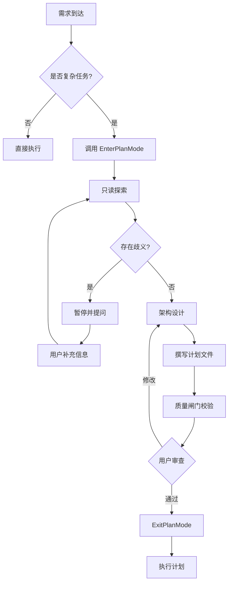
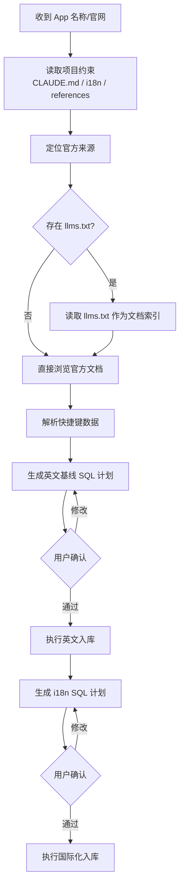

# Claude Code 技能包集合

<div align="center">


**生产级别的 Claude Code 技能包，助力高效开发**

[快速开始](#快速开始) • [技能列表](#技能列表) • [使用指南](#使用指南) • [目录结构](#目录结构)

</div>

---

## 目录

- [简介](#简介)
- [技能列表](#技能列表)
  - [1. Plan Mode](#1-plan-mode)
  - [2. React Dev](#2-react-dev)
  - [3. Vue Dev](#3-vue-dev)
  - [4. Java Dev](#4-java-dev)
  - [5. Code Simplifier](#5-code-simplifier)
  - [6. Official Hotkey Ingestion](#6-official-hotkey-ingestion)
- [快速开始](#快速开始)
- [使用指南](#使用指南)
- [目录结构](#目录结构)
- [贡献指南](#贡献指南)

---

## 简介

这是一个专为 **Claude Code** 设计的技能包集合，包含 6 个核心技能模块，覆盖架构规划、前端开发、后端开发、代码质量和数据入库等场景。每个技能包都经过精心设计，遵循生产级别的最佳实践，旨在提升开发效率和代码质量。

### 核心特性

- **生产级别规范**：所有技能包遵循业界公认的最佳实践
- **类型安全优先**：前端强制使用 TypeScript strict 模式，后端遵循 Alibaba Java 规范
- **流程可控**：Plan Mode 先计划后执行，关键操作需人工确认
- **官方来源保证**：Hotkey Ingestion 只采信官方文档，杜绝猜测
- **代码质量闭环**：Code Simplifier 对已修改代码进行精炼，保持一致性

---

## 技能列表

### 1. Plan Mode

> **深度架构规划 + 强制代码落地**

完整复刻 Claude Code 官方 Plan Mode 架构，专为复杂项目的架构设计和技术规划而生。

#### 核心特性

- **零副作用原则**：只读模式运行，不修改现有代码
- **代码优先规则**：拒绝模糊描述，强制输出具体代码实现
- **询问优先于假设**：遇到歧义立即暂停，向用户提问
- **强制计划模板**：标准化的 Markdown 计划文件格式
- **计划质量闸门**：内置 `check_plan_quality.py` 和 `check_plan_scope.py` 脚本验证计划质量

#### 适用场景

- 复杂系统的架构设计
- 大型重构项目的规划
- 技术选型和方案对比
- 需要详细实施步骤的任务

#### 参考文档

| 文件 | 说明 |
|------|------|
| `agent-prompt-plan-mode-enhanced.md` | 增强版代理提示词 |
| `system-reminder-plan-mode-is-active.md` | Plan Mode 激活时的系统提醒 |
| `system-reminder-plan-mode-re-entry.md` | Plan Mode 重入提醒 |
| `tool-description-enterplanmode.md` | EnterPlanMode 工具描述 |
| `tool-description-exitplanmode-v2.md` | ExitPlanMode 工具描述（v2） |
| `plan-quality-gates.md` | 计划质量闸门规范 |
| `environment-checklist.md` | 环境与依赖检查清单 |
| `api_reference.md` | API 参考文档 |

#### 辅助脚本

| 脚本 | 说明 |
|------|------|
| `check_plan_quality.py` | 验证计划文件质量 |
| `check_plan_scope.py` | 校验计划范围合理性 |
| `init_plan.py` | 初始化标准计划模板 |
| `list_plan_refs.py` | 列出计划引用资源 |
| `context7_api.py` | Context7 文档查询集成 |
| `web_search.py` | 网络搜索辅助工具 |

#### 工作流程


```mermaid
graph TD
    A[需求到达] --> B{是否复杂任务?}
    B -- 否 --> C[直接执行]
    B -- 是 --> D[调用 EnterPlanMode]
    D --> E[只读探索]
    E --> F{存在歧义?}
    F -- 是 --> G[暂停并提问]
    G --> H[用户补充信息]
    H --> E
    F -- 否 --> I[架构设计]
    I --> J[撰写计划文件]
    J --> K[质量闸门校验]
    K --> L{用户审查}
    L -- 修改 --> I
    L -- 通过 --> M[ExitPlanMode]
    M --> N[执行计划]
```

---

### 2. React Dev

> **React/Next.js 开发专家代理**

资深 React 开发专家，提供生产级别的 Next.js 架构方案和代码实现。

#### 技术栈

| 类别 | 技术 | 说明 |
|------|------|------|
| **框架** | Next.js | App Router + Server Components |
| **语言** | TypeScript | Strict 模式 |
| **UI 库** | Shadcn-UI | 按需引入的组件库 |
| **样式** | Tailwind CSS | 原子化 CSS |
| **动画** | Framer Motion | 流畅的交互动画 |
| **状态管理** | Jotai | 原子化全局状态 |
| **数据请求** | SWR | 客户端数据获取与缓存 |
| **包管理器** | pnpm | 高效的依赖管理 |

#### 核心原则

1. **RSC 策略**：默认 Server Component，最小化 Client Component，`use client` 下沉到最小边界
2. **状态管理**：状态最小化、就近原则、单向数据流；局部用 `useState`，跨组件用 Jotai，服务端数据用 SWR
3. **组件规范**：ES6 箭头函数 + `React.FC`，必须添加 `displayName`，文件命名 `kebab-case.tsx`，单文件不超过 300 行
4. **性能优化**：`React.memo` 防止不必要重渲染，大列表虚拟化，图片使用 Next.js Image 组件
5. **错误处理**：Error Boundary + try...catch

#### 17 条组件封装原则

基本属性绑定、注释规范、export 暴露、入参类型约束、class 与 style 规则、继承透传、事件配套、ref 绑定、自定义扩展性、受控与非受控模式、最小依赖、功能拆分与单一职责、通用与业务组件边界、最大深度扩展性、多语言可配置化、异常捕获与提示、语义化原则。

---

### 3. Vue Dev

> **Vue 3 开发专家代理**

资深 Vue 3 开发专家，基于 Composition API 提供生产级别的架构方案。

#### 技术栈

| 类别 | 技术 | 说明 |
|------|------|------|
| **框架** | Vue 3 | Composition API + `<script setup>` |
| **构建工具** | Vite | 快速构建与热更新 |
| **语言** | TypeScript | Strict 模式 |
| **UI 库** | Element Plus / Naive UI | 按需引入 |
| **样式** | Tailwind CSS / Scoped SCSS | 灵活的样式方案 |
| **状态管理** | Pinia | 原子化状态管理 |
| **路由** | Vue Router 4 | 官方路由方案 |
| **动画** | VueUse Motion / GSAP | 动画解决方案 |
| **包管理器** | pnpm | 高效的依赖管理 |

#### 核心原则

1. **组件开发**：使用 `<script setup lang="ts">`，逻辑抽离到 `composables/`，文件命名 `kebab-case.vue`，单文件不超过 300 行
2. **状态管理**：局部状态用 `ref`/`reactive`，全局状态用 Pinia，避免巨型 store
3. **性能优化**：`shallowRef` 处理大对象，合理使用 `<KeepAlive>`，大列表使用虚拟滚动
4. **错误处理**：`errorCaptured` + try...catch
5. **组件透传**：`v-bind="$attrs"` 透传属性，`defineExpose` 暴露方法，所有 props 必须 JSDoc 注释

---

### 4. Java Dev

> **Java 企业级开发专家（基于阿里巴巴 Java 开发手册）**

遵循阿里巴巴 Java 开发手册（嵩山版）的综合 Java 开发技能，涵盖编码规范、并发、异常、数据库、安全等全维度指导。

#### 触发场景

- 编写新的 Java 代码（`.java` 文件）
- 审查或重构已有 Java 项目
- MySQL 数据库设计
- API 设计与实现
- 单元测试
- 并发编程
- 安全实现

#### 参考规范文档

| 文件 | 说明 |
|------|------|
| `naming-conventions.md` | 命名规范 |
| `coding-standards.md` | 编码规约 |
| `concurrency.md` | 并发编程规范 |
| `exception-logging.md` | 异常与日志规范 |
| `database.md` | 数据库设计规范 |
| `security.md` | 安全编码规范 |
| `testing.md` | 单元测试规范 |
| `design.md` | 架构设计规范 |

#### 核心原则

1. **可读性**：命名清晰，代码逻辑一目了然
2. **一致性**：统一命名和格式规范
3. **安全优先**：防范 NPE、SQL 注入、并发安全问题
4. **性能意识**：考虑设计决策对性能的影响
5. **测试覆盖**：关键业务代码必须有充分的单元测试

---

### 5. Code Simplifier

> **代码精炼与可维护性提升**

专注于提升代码清晰度、一致性和可维护性，在完整保留功能的前提下对近期修改的代码进行精炼。

#### 核心原则

- **功能零损失**：绝不改变代码行为，只改变实现方式
- **项目标准对齐**：遵循 CLAUDE.md 中的编码规范
- **可读性优先**：选择清晰明确的写法，而非过度紧凑
- **聚焦最近改动**：默认针对近期修改的代码，除非明确指定

#### 适用场景

- PR 提交前的代码审查与精炼
- 重构后的一致性检查
- 引入新团队成员前的代码规范对齐

---

### 6. Official Hotkey Ingestion

> **官方快捷键收录与数据库入库**

从官方文档发现、解析并将应用快捷键按标准 Schema 写入 PostgreSQL，分两阶段执行：英文基线 -> 国际化。

#### 触发场景

- 收录某个 App 的官方快捷键
- 快捷键入库 / 导入 shortcuts
- 同步官方 shortcut docs 到数据库
- 补全 `app_hotkey` / `app_faq` / `app_i18n` / `app_hotkey_i18n` / `app_faq_i18n`
- 只给一个 App 名称或官网，让 AI 自行查找官方来源

#### 不可妥协的边界

- **只使用官方来源**：官网、官方帮助中心、官方文档、官方发布说明
- **不猜测**：绝不根据平台惯例或 UI 推测未被官方明确写出的按键
- **不采信第三方**：论坛帖子、社区回答、第三方快捷键站一律排除
- **先计划后执行**：生成 SQL 计划后等用户确认，再通过 PostgreSQL MCP 执行

#### 参考文档

| 文件 | 说明 |
|------|------|
| `source-discovery.md` | 如何定位官方来源 |
| `output-template.md` | 计划输出骨架模板 |
| `sql-rules.md` | SQL 组织方式与执行前核对项 |

#### 工作流程


```mermaid
graph TD
    A[收到 App 名称/官网] --> B[读取项目约束<br>CLAUDE.md / i18n / references]
    B --> C[定位官方来源]
    C --> D{存在 llms.txt?}
    D -- 是 --> E[读取 llms.txt 作为文档索引]
    D -- 否 --> F[直接浏览官方文档]
    E --> F
    F --> G[解析快捷键数据]
    G --> H[生成英文基线 SQL 计划]
    H --> I{用户确认}
    I -- 修改 --> H
    I -- 通过 --> J[执行英文入库]
    J --> K[生成 i18n SQL 计划]
    K --> L{用户确认}
    L -- 修改 --> K
    L -- 通过 --> M[执行国际化入库]
```

---

## 快速开始

### 使用 `npx skills update` 同步技能

```bash
SKILLS_REPO=<你的技能仓库地址> npx skills update
```

该命令会将技能同步到 `$CODEX_HOME/skills`（默认 `~/.codex/skills`），并从 `master` 分支执行快进更新。详细说明见：`docs/npx-skills-update.md`。

### 前置要求

- 安装 [Claude Code CLI](https://claude.com/claude-code)
- Node.js >= 18
- pnpm >= 8（前端技能）
- JDK >= 17（Java Dev 技能）

### 安装技能包

1. 克隆本仓库：

```bash
git clone <repository-url>
cd skills
```

2. 将技能包目录链接到 Claude Code 技能目录：

```bash
# macOS/Linux - 批量链接所有技能
for skill in plan-mode react-dev vue-dev java-dev code-simplifier official-hotkey-ingestion; do
  ln -s "$(pwd)/$skill" ~/.claude/skills/$skill
done

# Windows（需要管理员权限，逐一执行）
mklink /D "%USERPROFILE%\.claude\skills\plan-mode" "%CD%\plan-mode"
mklink /D "%USERPROFILE%\.claude\skills\react-dev" "%CD%\react-dev"
mklink /D "%USERPROFILE%\.claude\skills\vue-dev" "%CD%\vue-dev"
mklink /D "%USERPROFILE%\.claude\skills\java-dev" "%CD%\java-dev"
mklink /D "%USERPROFILE%\.claude\skills\code-simplifier" "%CD%\code-simplifier"
mklink /D "%USERPROFILE%\.claude\skills\official-hotkey-ingestion" "%CD%\official-hotkey-ingestion"
```

3. 验证安装：

```bash
claude skills list
```

---

## 使用指南

### 自动触发（推荐）

技能包会根据上下文关键词自动触发：

```bash
# 自动触发 plan-mode（检测到复杂架构任务）
claude "设计一个微服务架构的电商系统"

# 自动触发 react-dev（检测到 .tsx 文件）
claude "优化 src/components/user-profile.tsx 的性能"

# 自动触发 vue-dev（检测到 .vue 文件）
claude "重构 src/views/dashboard.vue 组件"

# 自动触发 java-dev（检测到 .java 文件）
claude "审查 UserService.java 的并发安全问题"

# 自动触发 code-simplifier（代码精炼场景）
claude "精炼最近修改的代码"

# 自动触发 official-hotkey-ingestion（快捷键入库场景）
claude "收录 VS Code 的官方快捷键"
```

### 显式调用技能

```bash
claude "请使用 plan-mode 技能帮我规划一个用户认证系统"
claude "使用 react-dev 技能创建一个可复用的 Modal 组件"
claude "使用 java-dev 技能设计一个线程安全的缓存类"
```

### 技能组合使用

```bash
# 先用 Plan Mode 规划，再用 React Dev 实现
claude "使用 plan-mode 规划博客系统，然后用 react-dev 实现首页"

# Java 后端 + Plan Mode 规划
claude "用 plan-mode 设计 RESTful API 架构，用 java-dev 实现"
```

---

## 目录结构

```plaintext
skills/
├── README.md                              # 本文件
├── plan-mode/                             # Plan Mode 技能包
│   ├── SKILL.md                           # 技能定义文件
│   ├── references/                        # 参考文档
│   │   ├── agent-prompt-plan-mode-enhanced.md
│   │   ├── system-reminder-plan-mode-is-active.md
│   │   ├── system-reminder-plan-mode-is-active-for-subagents.md
│   │   ├── system-reminder-plan-mode-re-entry.md
│   │   ├── tool-description-enterplanmode.md
│   │   ├── tool-description-exitplanmode-v2.md
│   │   ├── plan-quality-gates.md
│   │   ├── environment-checklist.md
│   │   └── api_reference.md
│   └── scripts/                           # 辅助脚本
│       ├── check_plan_quality.py
│       ├── check_plan_scope.py
│       ├── init_plan.py
│       ├── list_plan_refs.py
│       ├── context7_api.py
│       └── web_search.py
├── react-dev/                             # React Dev 技能包
│   └── SKILL.md
├── vue-dev/                               # Vue Dev 技能包
│   └── SKILL.md
├── java-dev/                              # Java Dev 技能包
│   ├── SKILL.md
│   └── references/                        # 阿里巴巴 Java 规范文档
│       ├── naming-conventions.md
│       ├── coding-standards.md
│       ├── concurrency.md
│       ├── exception-logging.md
│       ├── database.md
│       ├── security.md
│       ├── testing.md
│       └── design.md
├── code-simplifier/                       # Code Simplifier 技能包
│   └── SKILL.md
└── official-hotkey-ingestion/             # Official Hotkey Ingestion 技能包
    ├── SKILL.md
    ├── README.md
    ├── references/                        # 入库规范文档
    │   ├── source-discovery.md
    │   ├── output-template.md
    │   └── sql-rules.md
    └── evals/                             # 评估用例
```

---

## 贡献指南

### 贡献流程

1. Fork 本仓库
2. 创建特性分支：`git checkout -b feature/new-skill`
3. 提交更改：`git commit -m "Add new skill: xxx"`
4. 推送到分支：`git push origin feature/new-skill`
5. 提交 Pull Request

### 技能包开发规范

**文件结构：**

```
skill-name/
├── SKILL.md          # 必需：技能定义文件
├── README.md         # 可选：详细说明文档
├── references/       # 可选：参考文档目录
└── evals/            # 可选：评估用例目录
```

**SKILL.md 格式：**

```markdown
---
name: skill-name
description: 简短描述（一句话，含触发关键词）
model: claude-sonnet-4-6
color: purple
---

# 技能内容
```

**命名规范：**

- 技能名称：`kebab-case`
- 文件名称：`SKILL.md`（大写）
- 目录名称：与技能名称一致

**文档要求：**

- 使用中文编写
- 包含清晰的触发场景描述
- 说明不可妥协的边界条件
- 提供工作流程图（Mermaid）

---

## 许可证

MIT License

---

## 联系方式

- 作者：Daemon
- 项目地址：`/Users/fangxi/independent/agents/skills`

---

<div align="center">

**用生产级别的技能包，打造高质量的代码**

</div>
