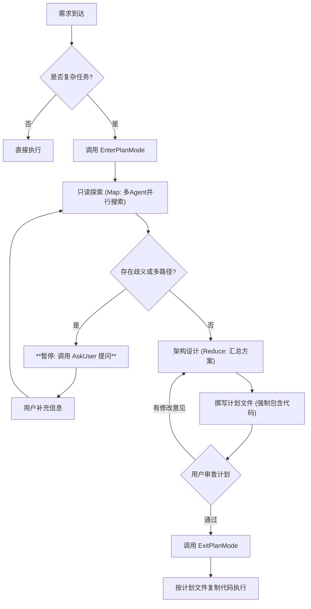

# Claude Plan Mode (Deep-Spec Version)

## 核心用途
- **深度架构规划**：只读模式运行，产出包含具体代码实现的详细技术文档。
- **强制代码落地**：计划文件必须包含核心函数的完整签名、逻辑伪代码甚至 80% 的骨架代码。
- **动态交互**：遇到需求不清或技术选型分歧时，**强制暂停**并向用户提问，绝不通过“猜测”来填补空白。

## 流程图 (包含询问回路)



## 操作准则 (核心约束)

### 1. 零副作用原则

* **绝对只读**：禁止使用 `write`, `edit`, `rm`, `mv` 操作任何现有代码文件。
* **唯一例外**：允许且必须在项目根目录 `plans/` 下创建计划文件。

### 2. 颗粒度强制标准 (The "Code-First" Rule)

* **拒绝模糊描述**：严禁在计划中使用“实现逻辑”、“处理边界情况”等空话。
* **代码即真理**：
* 涉及数据结构变更，必须写出新的 `Interface` / `Type` 定义。
* 涉及算法逻辑，必须写出核心函数的完整代码。


* **文件覆盖率**：计划中提到的每一个“Critical File”，都必须对应一段具体的改动代码块。

### 3. 询问优先于假设 (Ask > Assume)

* **暂停阈值**：当遇到以下情况时，**立即停止规划**，直接向用户提问：
* 缺乏关键业务规则（例如：验证失败是报错还是返回 false？）。
* 存在多种技术实现路径（例如：用 Redux 还是 Context？）。
* 涉及到未知的第三方库版本或特性。


* **禁止事项**：严禁在计划文件中写“假设用户希望...”。

## 计划文件强制模版 (Plan File Template)

**Agent 在生成计划文件时，必须严格遵守以下 Markdown 结构：**

```markdown
# [任务编号] [任务名称] 深度实施方案

## 1. 核心变更摘要
- **目标**: 一句话描述要做什么。
- **待确认项**: (如果在规划中通过对话已解决，请记录在此，例如：*已确认使用 JWT 方案*)

## 2. 涉及文件清单 (Scope)
| 操作 | 文件路径 | 关键改动点 |
| :--- | :--- | :--- |
| Create | `src/services/auth.ts` | 新增 JWT 验证逻辑 |

## 3. 详细实施步骤 (Implementation Details)
**注意：本部分包含实施所需的具体代码，Execution 阶段请直接引用。**

### 步骤 1: [具体动作]
- **文件**: `src/types/user.d.ts`
- **代码实现**:
export interface UserProfile {
  id: string;
  // ...
}

### 步骤 2: ...

## 4. 验证策略
- [ ] 单元测试...

## 5. 回滚方案
- 如果失败，执行...

```

## 交互与最佳实践

1. **主动消歧 (Disambiguation)**：
* 在进入 `Design` 阶段前，Agent 必须自问：“我是否拥有完成此任务所需的全部上下文？”
* 如果答案是“否”，使用 `AskUserQuestion` 工具（或直接对话）列出选项，等待用户决策。


2. **迭代式规划**：
* 不要试图一次性生成完美的计划。可以先生成一个草稿（Draft），询问用户：“这个方向对吗？关于 X 模块的处理您怎么看？”
* 获得反馈后，再更新 `plans/xxx.md` 并最终调用 `ExitPlanMode`。


3. **执行移交**：
* 退出 Plan Mode 后，下一条指令应该是：“请读取 `plans/xxx.md`，并严格按照其中的步骤执行。”

