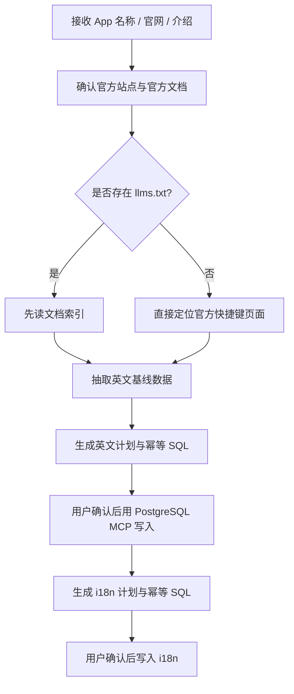

# official-hotkey-ingestion

这个技能把“收录某个 App 的官方快捷键并写入当前项目数据库”这套流程固定下来，避免每次都从头讲一遍规则。

## 它解决什么问题
- 用户可能只给一个 App 名称，需要你自己找官网和官方快捷键文档。
- 用户也可能给官网、产品介绍，甚至只说“把这个 App 的快捷键入库”。
- 快捷键事实只能来自官方资料，不能靠第三方站点或经验猜测。
- 入库流程固定分两段：先英文基线，再国际化。
- SQL 可能很长，计划里可以缩写，但真正执行时必须是完整 SQL。

## 什么时候该触发
- 用户说“收录某个 App 的官方快捷键”
- 用户说“快捷键入库”“导入 shortcuts / hotkeys”
- 用户要“同步官方 shortcut docs 到 PostgreSQL”
- 用户要补 `app_hotkey`、`app_faq`、`app_i18n`、`app_hotkey_i18n`、`app_faq_i18n`
- 用户只给 App 名称，让你自己找官网与官方文档

## 固定工作流



## 关键约束
- 只认官方来源：官网、官方 docs、官方 help、官方发布说明。
- 不认第三方快捷键站、论坛、博客转载、社区贴。
- 官方没有明确写出的快捷键，不能猜。
- 非严格快捷键的方法说明写 `app_faq`，不要伪装成 `app_hotkey`。
- 一定先出计划，再等用户确认，再通过 PostgreSQL MCP 执行。
- 国际化默认补：`zh`、`ja`、`ru`、`ar`、`de`、`fr`、`pt`、`in`。
- 路由层 `id` 在数据库里对应 `in`。

## 目录说明
- `SKILL.md`：核心工作流与边界
- `references/source-discovery.md`：如何判断资料是不是官方
- `references/output-template.md`：计划稿模板
- `references/sql-rules.md`：SQL 组织规则与手动验收清单
- `evals/evals.json`：功能型测试提示词
- `evals/trigger-evals.json`：description 触发优化用的 query 集

## 推荐使用方式

### 英文基线
用户示例：

```text
收录 Raycast 的官方快捷键。官网你自己找，只能用官方资料。先给英文基线计划和 SQL，等我确认后再写库。
```

### 补 i18n
用户示例：

```text
英文基线已经有了，slug 是 claude-code。现在补齐 zh、ja、ru、ar、de、fr、pt、in 的快捷键和 FAQ 国际化。先给计划和 SQL。
```

## 关于 trigger eval 集
- `evals/trigger-evals.json` 里放的是 description 优化用的真实用户风格 query。
- 其中既有 should-trigger，也有 should-not-trigger。
- 正样本覆盖：只有 App 名称、只有官网、只有产品介绍、只补 i18n、同步官方更新。
- 负样本覆盖：前端快捷键交互、第三方抓取、数据库性能优化、文案润色、站内 UI 改造等近邻任务。

## 当前不做的事
- 不运行自动测试、编译、lint。
- 不直接改站点业务代码。
- 不在证据不足时硬凑 SQL。

## 下一步怎么用
- 如果你要继续做 description 优化，可以拿 `evals/trigger-evals.json` 去跑 `skill-creator` 的 trigger loop。
- 如果你只想日常使用，这个技能现在已经能直接承接“官方快捷键入库”类任务。
