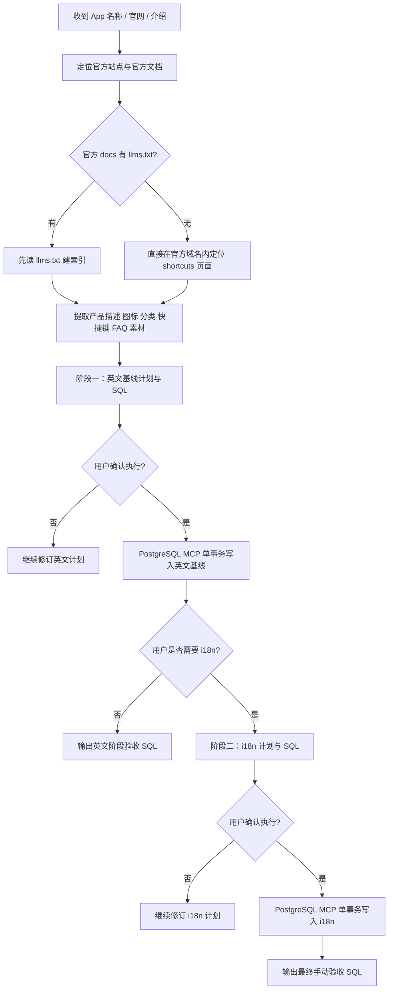

# Official Hotkey Ingestion

## 这个技能负责什么
- 将某个 App 的官方快捷键按当前项目数据库模型落库。
- 把整个流程固定成两段：先英文基线，再国际化。
- 始终先给计划与 SQL，再等用户确认执行。

## 进入任务后的第一步
先读取这些项目内信息，把它们当作当前仓库的真实约束：
- `CLAUDE.md`：数据库表结构、字段语义、页面路由与构建约束
- `src/i18n/config.ts`：语言列表与 `id -> in` 的数据库映射
- `references/source-discovery.md`：如何定位官方来源
- `references/output-template.md`：计划输出骨架
- `references/sql-rules.md`：SQL 组织方式与执行前核对项

## 不可妥协的边界
- 只使用官方来源：官网、官方帮助中心、官方文档、官方发布说明、官方产品内帮助内容。
- 允许的输入只有三类：
  - App 官网
  - 一段产品介绍
  - 只有 App 名称
- 如果用户只给 App 名称，先定位官方站点，再在官方域名内寻找快捷键资料。
- 如果官方文档存在 `llms.txt`，先读取它作为文档索引，再展开浏览。
- 绝不把第三方快捷键站、论坛帖子、社区回答当作快捷键事实来源。
- 绝不根据通用习惯、平台惯例、UI 猜测任何未被官方明确写出的按键。
- 若缺少官方快捷键依据，必须停止执行并明确说明“证据不足，不能安全入库”。
- 全程使用简体中文回复。
- 不改仓库业务代码；只有在用户确认后，才允许通过 PostgreSQL MCP 写数据库。

## 总流程

## 阶段一：英文基线
1. 确认权威来源，只保留官方页面。
2. 识别应用主记录业务字段：`name`、`slug`、`website`、`author`、`description`、`icon_svg`。
3. 所有主键与关联键都按 UUID 方案处理；`slug` 只作为业务定位与去重条件，不能充当关联键。
4. 识别分类绑定，例如 `Development`、`Terminal` 这类站内分类。
5. 将严格快捷键写入 `public.app_hotkey`。
6. 将方法说明、配置前提、输入模式等非严格快捷键写入 `public.app_faq`。
7. 生成幂等 SQL。
8. 按 `references/output-template.md` 输出计划。
9. 明确列出：
   - 预期 `app_hotkey` 行数
   - FAQ 行数
   - OS 分布
   - 关键假设
   - 官方依据链接
10. 等待用户确认后，再执行 SQL。

## 阶段二：国际化
1. 只在英文基线已经存在后继续。
2. 默认补齐数据库 locale：`zh`、`ja`、`ru`、`ar`、`de`、`fr`、`pt`、`in`。
3. 注意：当前项目里路由层 `id` 对应数据库 `in`。
4. 默认策略：
   - `app_i18n.name = NULL`，保留英文品牌名回退
   - `app_i18n.description` 全量翻译
   - `app_hotkey_i18n.category/action` 全量翻译
   - `app_faq_i18n.question/answer` 全量翻译
5. 翻译完成后：
   - 若 `humanizer` skill 可用，用它润色 `description` 和 FAQ
   - `category` 与 `action` 保持短、稳、可扫描，不追求文学化
6. 生成幂等 SQL，先给计划，等用户确认后再执行。

## 数据归类规则
- 写入 `public.app_hotkey`：
  - 官方明确给出的按键组合
  - 官方明确当作输入触发符展示的单字符触发，例如 `/`、`!`、`@`、`?`
- 写入 `public.app_faq`：
  - 非严格键盘快捷键的方法说明
  - 终端或编辑器前置设置
  - 某快捷键为何可能无效的原因说明
  - “直接粘贴”“进入某模式再输入”这类行为说明
- 分类优先沿用官方分节标题；如果必须归并，只做最小化归并。
- 只有在官方明确区分 OS 时才写平台差异；若官方明确说某绑定通用于多平台，才对适用平台展开，绝不脑补额外平台。

## macOS 键位展示规则
- 只要是 macOS 绑定，入库与计划展示时都使用标准键盘图标，不使用 `Command`、`Option`、`Control`、`Shift` 这类英文单词。
- 常见等价标准化：`Command -> ⌘`、`Option/Alt -> ⌥`、`Control -> ⌃`、`Shift -> ⇧`、`Caps Lock -> ⇪`、方向键 -> `↑` `↓` `←` `→`。
- 字母、数字、功能键等非修饰键保留官方键名或字符，不要为了图标化而改写原始语义。
- 若官方页面已直接使用 macOS 图标，必须原样沿用；若官方仅写文本键名，可在不改变事实的前提下做等价符号标准化，并在计划里明确说明。

## SQL 生成规则
- 所有写入必须放在单事务里：`BEGIN ... COMMIT`。
- 优先用 `WITH` CTE 组织输入数据与 upsert 逻辑。
- 所有写入都必须幂等：
  - `INSERT ... ON CONFLICT DO UPDATE`
  - 或 `ON CONFLICT DO NOTHING` 配合存在性判断
- 所有主键与外键都必须使用 UUID：`public.app.id`、`public.app_hotkey.id`、`public.app_faq.id` 以及各 i18n / 关联表的 `*_id` 字段都按 UUID 写入。
- `slug`、`name`、`category`、`action` 等业务字段只用于定位、去重和 upsert，绝不能直接充当主键或外键。
- 写下游关联表前，必须先通过 `RETURNING`、CTE 或基于唯一键的回查拿到上游 UUID，再继续写入。
- 英文阶段至少覆盖：
  - `public.app`
  - `public.app_category`
  - `public.app_hotkey`
  - `public.app_faq`
- 国际化阶段至少覆盖：
  - `public.app_i18n`
  - `public.app_hotkey_i18n`
  - `public.app_faq_i18n`
- 大批量翻译映射优先使用 `jsonb_each` / `jsonb_each_text` 展开。
- 若 schema 提供 `gen_random_uuid()`、`uuidv7()` 或等价 UUID 生成函数，只能用于新增行；重复执行是否命中同一业务记录，必须依赖表上的真实唯一约束。
- 如果 SQL 很长，计划里可以省略部分映射正文，但必须：
  - 给出完整事务骨架
  - 说明哪些长映射被省略
  - 明确承诺“执行时使用完整 SQL，不遗漏任何映射”
- 真正调用 PostgreSQL MCP 时，必须发送完整无删节 SQL，不允许遗漏任何 locale、action、FAQ 或热键行。

## 图标与描述规则
- `description` 必须来自官方产品概述页或首页文案，必要时可做最小化摘写，但不要杜撰卖点。
- `icon_svg` 优先使用官方站点里可直接复用的 SVG 标识。
- 若官方站点没有可安全复用的 SVG，可单独为 `icon_svg` 使用互联网检索补充图标素材；这只放宽图标来源，不放宽快捷键、FAQ、描述等事实信息的官方来源要求。
- 图标检索不局限于特定站点；可使用任意能搜索到目标图标的公开图标站、品牌图标库或通用搜索结果，例如 LobeHub Icons、AllSVGIcons 等。
- 优先顺序：官方 SVG > 可检索到的品牌或产品对应 SVG > 语义接近的通用图标；只有前两者都不可得时，才退回通用图标。
- 禁止私自重绘、臆造品牌 Logo，或把第三方站点的文字说明当作产品事实来源；如果使用了非官方图标源，计划里要明确注明图标来源链接，并标注“仅用于 `icon_svg` 素材补充”。

## 输出格式
- 信息不足时，只补最少的问题，优先确认官方站点与官方快捷键页面。
- 信息足够后，先输出“计划稿”，结构遵循 `references/output-template.md`。
- 规划超过 3 步时，计划里必须包含 Mermaid 流程图。
- 不要在未确认前直接写库。
- 执行完成后，只汇报：
  - 是否成功
  - 实际写入或覆盖的数量
  - 手动验收 SQL
  - 因证据不足而被排除的条目

## 典型触发
**示例 1**
用户：`收录 Raycast 的快捷键，官网你自己找，只能用官方资料。`

你应该：先定位 Raycast 官方站点和官方快捷键文档，输出英文基线计划与 SQL，确认后入库，再做 i18n。

**示例 2**
用户：`这是官网 https://example.com ，把这个工具的 shortcuts 入库。`

你应该：只在该官方域名及其官方 docs 域名内寻找权威页面，识别 hotkey 与 FAQ，先给计划再执行。

**示例 3**
用户：`英文基线已经有了，补这个 app 的多语言快捷键翻译。`

你应该：跳过英文阶段，直接生成 i18n 计划与 SQL，确认后用 PostgreSQL MCP 写入。

**示例 4**
用户：`我只有应用名，叫 FooBar，帮我收录快捷键。`

你应该：先定位 FooBar 的官方站点与官方文档；如果找不到官方快捷键页，就明确停止，不要猜。
