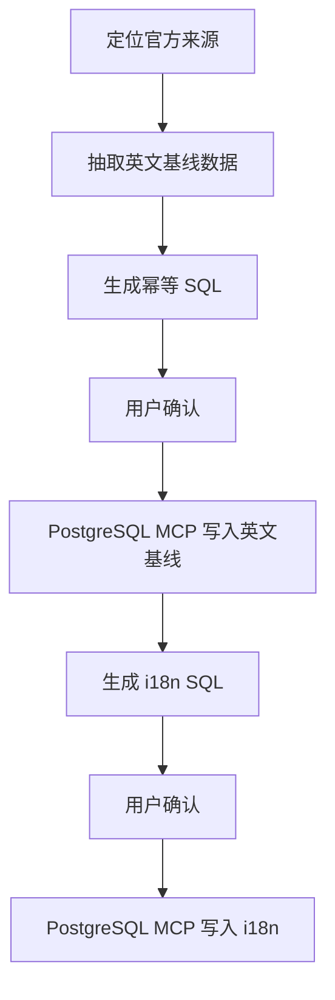

# 计划输出模板

当信息足够后，优先使用下面的结构输出计划。

## 1. 摘要
- 本次会写哪些表
- 是否只写英文，还是英文 + i18n
- 是否只动数据库，不改仓库代码
- 若是长 SQL，可说明计划里会省略部分映射正文，但执行时一定使用完整 SQL

## 2. 流程图

## 3. 数据决策
- 应用主记录：`slug`、`name`、`website`、`author`、`description`、`icon_svg`
- 分类绑定
- 站内分组映射
- 预计 hotkey / FAQ 行数与 OS 分布

## 4. 执行 SQL
- 如果 SQL 不长：可以完整贴出
- 如果 SQL 很长：只展示完整事务骨架、关键 CTE、代表性映射，并明确写出：
  - 计划中省略了哪些大段映射
  - 真正执行时会使用完整无删节 SQL
- 所有关联说明都以 UUID 链路描述；`slug` 只作为查询与去重条件，不作为表间关联键

## 5. 手动验收
- `app` 主记录检查
- `app_category` 绑定检查
- `app_hotkey` 总量与 OS 分布检查，且通过 `public.app.id` 关联校验
- `app_faq` 总量检查，且通过 `public.app.id` 关联校验
- 若是 i18n，再加：
  - `app_i18n` locale 覆盖
  - `app_hotkey_i18n` 每语种行数，并通过 hotkey UUID 关联校验
  - `app_faq_i18n` 每语种行数，并通过 FAQ UUID 关联校验

## 6. 假设与依据
- 本次有哪些保守假设
- 哪些内容因证据不足被排除
- 官方依据链接列表

## 7. 执行后汇报
- 只汇报实际写入或覆盖数量、是否成功、以及手动验收 SQL
