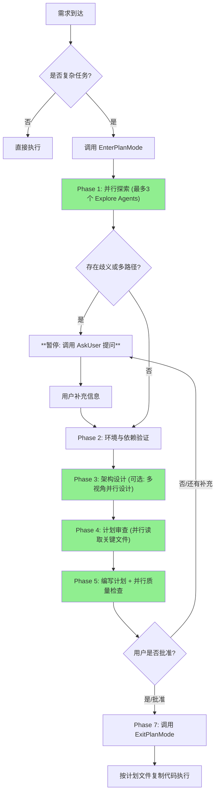

# Claude Plan Mode (Deep-Spec Version)

## 核心用途
- **深度架构规划**：只读模式运行，产出包含具体代码实现的详细技术文档。
- **强制代码落地**：计划文件必须包含核心函数的完整签名、逻辑伪代码甚至 80% 的骨架代码。
- **动态交互**：遇到需求不清或技术选型分歧时，**强制暂停**并向用户提问，绝不通过“猜测”来填补空白。

## 增强能力
- **质量闸门**：退出前必须通过计划质量闸门清单，避免“不可执行”的计划。
- **计划文件治理**：要求统一命名与增量更新，杜绝多份计划并存导致的执行偏差。
- **参考索引**：通过 references 索引按需加载详细规则，保持主提示简洁。

## 流程图 (包含询问回路与并行优化)



**并行优化标注**：
- 🟢 绿色节点：支持并行执行，可显著提升性能
- Phase 1: 最多 3 个 Explore agents 并行探索
- Phase 3: 可选的多视角并行设计（2 个 Plan agents）
- Phase 4: 并行读取多个关键文件
- Phase 5: 并行运行多个质量检查脚本

## 操作准则 (核心约束)

### 1. 零副作用原则

* **绝对只读**：禁止使用 `write`, `edit`, `rm`, `mv` 操作任何现有代码文件。
* **唯一例外**：允许且必须在项目根目录 `plans/` 下创建计划文件。
* **禁止状态变更命令**：禁止运行会改变系统或依赖状态的命令（如 install、init、format、commit）。

### 1.5 计划文件命名与更新策略

* **命名规则**：使用 `plans/YYYYMMDD-<slug>.md`，其中 `<slug>` 为任务摘要（英文/拼音均可）。
* **增量更新**：所有调整必须写入同一个计划文件，禁止生成多份平行计划。
* **版本提示**：关键方案变更需在“核心变更摘要”中标记（例如：`*已改为使用 JWT*`）。

### 2. 颗粒度强制标准 (The "Code-First" Rule)

* **拒绝模糊描述**：严禁在计划中使用“实现逻辑”、“处理边界情况”等空话。
* **代码即真理**：
* 涉及数据结构变更，必须写出新的 `Interface` / `Type` 定义。
* 涉及算法逻辑，必须写出核心函数的完整代码。


* **文件覆盖率**：计划中提到的每一个“Critical File”，都必须对应一段具体的改动代码块。

### 3. 询问优先于假设 (Ask > Assume)

* **暂停阈值**：当遇到以下情况时，**立即停止规划**，直接向用户提问：
* 缺乏关键业务规则（例如：验证失败是报错还是返回 false？）。
* 存在多种技术实现路径（例如：用 Redux 还是 Context？）。
* 涉及到未知的第三方库版本或特性。


* **禁止事项**：严禁在计划文件中写“假设用户希望...”。

### 4. 质量闸门 (Plan Quality Gates)

* **强制通过**：退出 Plan Mode 前必须逐条自检，未通过禁止调用 ExitPlanMode。
* **清单位置**：按需加载 `references/plan-quality-gates.md` 获取完整清单。

## 脚本工具 (scripts/)

* **初始化计划文件**：`scripts/init_plan.py <slug>`  
  - 默认写入 `plans/YYYYMMDD-<slug>.md`，并注入标准模板。  
  - 默认拒绝写入 `plans/` 以外路径（除非显式 `--allow-outside`）。
* **质量闸门检查**：`scripts/check_plan_quality.py <plan_file>`  
  - 检查必备章节、代码骨架、验证命令与回滚提示。
* **范围一致性检查**：`scripts/check_plan_scope.py <plan_file>`  
  - 检查 Scope 表格中“非 Create”的路径是否存在。
* **索引一致性检查**：`scripts/list_plan_refs.py`  
  - 校验 `references/api_reference.md` 中列出的文件是否缺失。
* **网络搜索辅助**：`scripts/web_search.py "<query>"`  
  - 基于 DuckDuckGo HTML 搜索，输出可引用的来源链接。  
  - 可使用 `--domain example.com` 限定域名，`--format json` 输出结构化结果。
* **Context7 API 辅助**：`scripts/context7_api.py`  
  - 仅从环境变量读取 API Key（默认 `CONTEXT7_API_KEY`），禁止写入文件或脚本。  
  - 子命令：`search --library-name <name> --query <q>` / `context --library-id <id> --query <q> --type txt`。

## 计划文件强制模版 (Plan File Template)

**Agent 在生成计划文件时，必须严格遵守以下 Markdown 结构：**

```markdown
# [任务编号] [任务名称] 深度实施方案

## 0. 预检清单 (Pre-Flight Checklist)
- [ ] 当前环境是否可通过构建？(Build Status)
- [ ] 关键依赖是否存在？
- [ ] 是否已读取并理解项目的 CONTRIBUTING.md 或代码规范？

## 1. 核心变更摘要
- **目标**: 一句话描述要做什么。
- **待确认项**: (如果在规划中通过对话已解决，请记录在此，例如：*已确认使用 JWT 方案*)

## 2. 涉及文件清单 (Scope)
| 操作 | 文件路径 | 关键改动点 |
| :--- | :--- | :--- |
| Create | `src/services/auth.ts` | 新增 JWT 验证逻辑 |

## 3. 核心数据结构与接口 (Data Structures & Interfaces)
**所有新定义的 Type/Interface 必须在此列出。这是代码实现的基石。**

```typescript
// src/types/user.ts
export interface UserProfile {
  id: string;
  role: 'admin' | 'user'; // Explicit union types, not just "string"
  preferences: UserPreferences; // Reference other interfaces
}
```

## 4. 详细实施步骤 (Implementation Details)
**注意：本部分必须包含可直接使用的代码骨架。禁止使用伪代码。**

### 步骤 1: [具体动作]
- **文件**: `src/types/user.d.ts`
- **依赖**: (列出需要 import 的模块)
- **代码骨架**:
```typescript
// 必须包含完整的函数签名和核心逻辑流
export async function updateUserProfile(userId: string, data: Partial<UserProfile>): Promise<void> {
    if (!userId) throw new Error("Invalid ID");
    // ... 具体调用 ...
}
```

### 步骤 2: ...

## 5. 验证策略 (Verification Strategy)
- [ ] 单元测试：`npm test -- auth.test.ts`
- [ ] 集成测试：`npm run test:integration`
- [ ] 手动验证：访问 `/login` 并检查 JWT token

## 6. 风险评估与回滚 (Risk & Rollback)

### 风险等级定义
- **Critical**: 影响生产环境核心功能（登录、支付、数据完整性）
- **High**: 影响主要功能但有降级方案
- **Medium**: 影响次要功能或性能
- **Low**: 仅影响开发体验或非关键路径

### 风险清单
| 风险点 | 等级 | 影响范围 | 缓解措施 |
|:---|:---|:---|:---|
| 修改 `auth.ts` 核心逻辑 | Critical | 全站登录 | 1. 编写回归测试<br>2. 在 staging 环境验证<br>3. 准备快速回滚脚本 |

### 回滚路径（按场景）

#### 场景 1: 纯代码变更（无数据库/API 变更）
```bash
# 方案 A: 回滚单个 commit
git revert <commit-hash>
git push origin main

# 方案 B: 回滚单个文件
git checkout HEAD~1 -- src/services/auth.ts
git commit -m "Rollback auth.ts to previous version"
```

#### 场景 2: 包含数据库迁移
```bash
# 1. 回滚代码
git revert <commit-hash>

# 2. 回滚数据库迁移
npm run migrate:down  # 或 alembic downgrade -1

# 3. 验证数据完整性
npm run db:verify
```

#### 场景 3: 包含 API 契约变更
```bash
# 1. 启用 API 版本兼容层（如果存在）
# 2. 回滚代码到上一版本
# 3. 通知依赖方 API 变更已回滚
# 4. 监控错误率恢复正常
```

#### 场景 4: 包含依赖升级
```bash
# 1. 回滚 package.json 和 lock 文件
git checkout HEAD~1 -- package.json package-lock.json

# 2. 重新安装依赖
npm ci

# 3. 重新构建
npm run build
```

### 回滚验证清单
- [ ] 回滚后运行完整测试套件
- [ ] 检查关键功能是否恢复正常
- [ ] 监控错误日志（至少 15 分钟）
- [ ] 通知相关团队成员

```

## 交互与最佳实践

1. **主动消歧 (Disambiguation)**：
* 在进入 `Design` 阶段前，Agent 必须自问：“我是否拥有完成此任务所需的全部上下文？”
* 如果答案是“否”，使用 `AskUserQuestion` 工具（或直接对话）列出选项，等待用户决策。


2. **迭代式规划**：
* 不要试图一次性生成完美的计划。可以先生成一个草稿（Draft），询问用户：“这个方向对吗？关于 X 模块的处理您怎么看？”
* 获得反馈后，再更新 `plans/xxx.md` 并最终调用 `ExitPlanMode`。


3. **执行移交**：
* 退出 Plan Mode 后，下一条指令应该是：“请读取 `plans/xxx.md`，并严格按照其中的步骤执行。”
